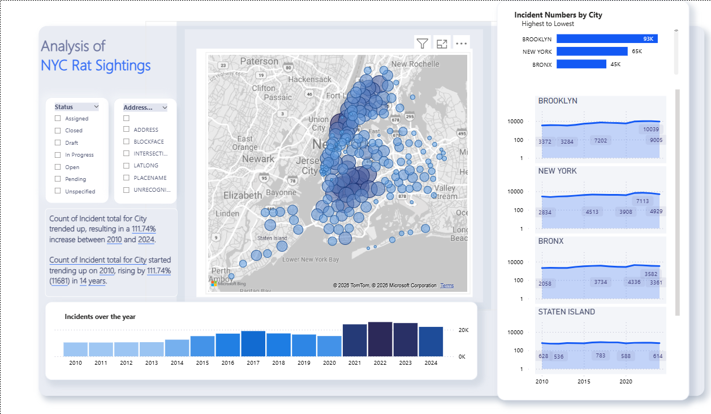

# NYC Rat Sightings Power BI Dashboard

## Overview
Power BI dashboard analyzing NYC rat sighting incidents using public NYC Open Data.
---

## Key Features

- Data cleaning and transformation using Power Query
- Data modeling (Star Schema approach)
- DAX measures for KPI calculations
- Year-over-year growth analysis
- Geographic distribution of incidents
- Dynamic filters and slicers (status, location, address type)
- KPI indicators
---

## Tools

- Power BI
- Power Query (M)
- DAX
- Data Modeling
- NYC Open Data (Public Dataset)
---

## Dashboard

